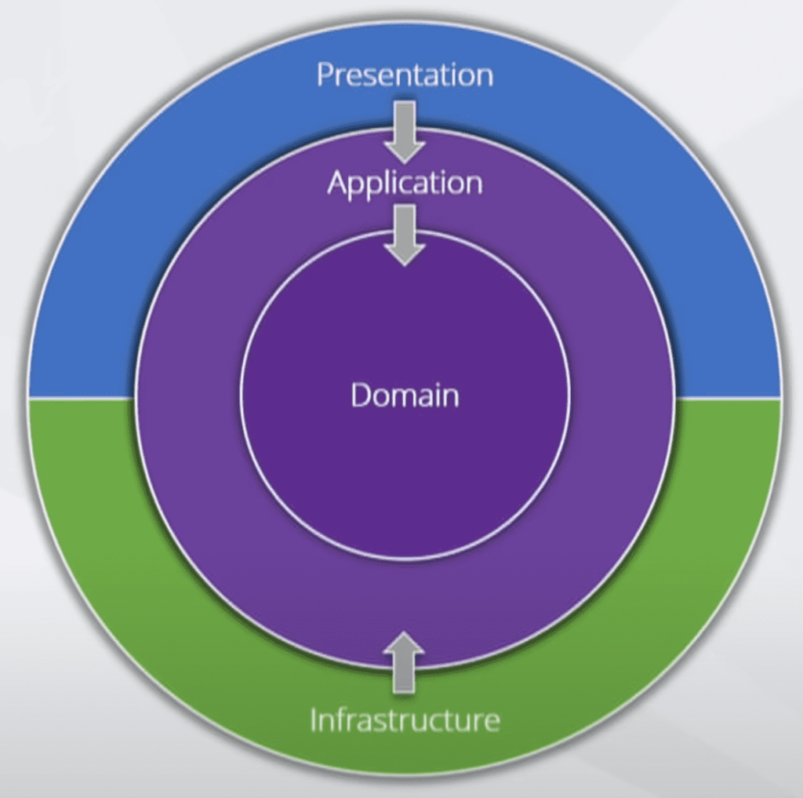

# 🛒 API Ecommerce
Api para geranciamento de produtos

## 🚀 Como Executar o Projeto
Você pode executar o projeto de duas maneiras: via **Docker Compose** ou diretamente pelo **Visual Studio**.

### ✅ Opção 1: Executar com Docker Compose
1. Na raiz do projeto, execute o comando:

   ```bash
   docker compose up -d
2. Com isso ira iniciar os seguintes servicos: Api, Banco de dados PostgreSQL, MinIO (armazenamento de arquivos)
3. A aplicacao estará disponível em: http://localhost:9003/swagger/index.html
4. Também disponibilizo uma collection do insomina com os endpoints para facilitar os testes (na raiz), basta importar no insominia o json

### ✅ Opção 2: Executar com o visual studio
1. Neste caso pode comentar o servico da api no docker-compose
2. Executar o comando:
      ```bash
      docker compose up -d
3. É necessario alterar: "BaseUrl": "http://minio:9000" para "BaseUrl": "http://localhost:9000"
4. É necessario alterar também: "EcommerceDb": "Host=postgres;Port=5432;Database=db_ecommerce;Username=postgres"
   para "EcommerceDb": "Host=localhost;Port=5432;Database=db_ecommerce;Username=postgres"
5. O docker-compose iniciara os seguintes servicos: Banco de dados PostgresSQL e MinIO

## 🛢 Estrutura do banco de dados
1. Optei por utilizar "DataBase First" onde ao subir o container é inicializado um scrip de banco de dados criando o banco e as tabelas

## 🔗 Estrutura do MinIo
1. Assim que o container do MinIo Sobe é executado um comando (presente no docker compose) para criar o bucket e torna-lo acessivel

## 📚 Documentação do Projeto

O projeto segue uma arquitetura em camadas, Clean Architecture:

### 🧠 Application
Contém os casos de uso (UseCases), DTOs, Behaviours, validações e manipuladores de comandos e queries com MediatR.

### 🏛 Domain
Define as entidades de negócio, interfaces de repositórios e contratos.

### 🏗 Infrastructure
Implementa os repositórios definidos na camada `Domain`, lida com o acesso a banco de dados (via Entity Framework Core) e configurações relacionadas à persistência e infraestrutura.

### 🎯 Presentation
Responsável pela camada de API (Controllers): endpoints públicos expostos para consumo externo.

A imagem abaixo representa essa estrutura em camadas (obs: imagem capturada da internet)


## 💡 Tecnologias Utilizadas
• ASP.NET Core 8  
• PostgreSQL  
• Entity Framework Core  
• Docker  
• MediatR  
• FluentValidation  
• Swagger / Swashbuckle  
• XUnit e Moq  
• MinIO (S3-compatible storage)  
• CI/CD (Github Actions)
